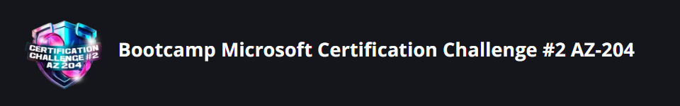

# BootCamp Microsoft certifications challenge \#2 AZ-204

Este projeto tem como objetivo a construção de uma API serverless utilizando a Azure Functions, que realiza a validação de CPFs, acessando uma API pública disponibilizada pela Secretaria da Receita Federal do Brasil. O sistema foi desenvolvido para ser escalável, de fácil manutenção e com custos reduzidos, aproveitando as vantagens de uma arquitetura serverless. Abaixo está um detalhamento do que foi feito, como a Azure Functions foi configurada e como a consulta de CPF foi integrada ao sistema.


#### **Arquitetura do Sistema**

1. **Azure Functions**:  
   * O projeto foi desenvolvido utilizando **Azure Functions**, uma plataforma serverless oferecida pela Microsoft. Com as Azure Functions, conseguimos criar funções específicas para realizar tarefas (como a validação do CPF) sem precisar gerenciar servidores ou infraestrutura, o que torna a aplicação mais eficiente, escalável e econômica.  
   * A vantagem da arquitetura serverless é que pagamos apenas pelo tempo de execução das funções, o que significa que o sistema pode escalar automaticamente de acordo com a demanda.  
2. **Integração com a API de Consulta de CPF**:  
   * O serviço de validação de CPF utiliza uma API pública fornecida pelo **Governos do Brasil (Receita Federal)**. Através dessa API, podemos consultar se um CPF é válido ou inválido, obtendo informações sobre o status do CPF diretamente da Receita Federal.  
   * **Endpoint utilizado**: A API de validação de CPF está disponível em dois ambientes, produção e homologação. Usamos o endpoint de produção:  
     * **Produção**: `https://apigateway.conectagov.estaleiro.serpro.gov.br/api-cpf-light/v2/consulta/cpf`  
   * A comunicação com a API é feita usando a biblioteca **Axios** para realizar requisições HTTP e retornar os dados no formato desejado.  
3. **Fluxo de Validação de CPF**:  
   * O processo de validação começa quando um usuário envia um **CPF** via uma requisição POST para o endpoint `/validar-cpf`.  
   * A função Azure chama a API de consulta de CPF para verificar o status do CPF.  
   * Dependendo da resposta da API, o sistema retorna um JSON com o status do CPF, informando se é válido ou inválido.  
4. **Swagger para Documentação da API**:  
   * A documentação da API foi gerada utilizando o **Swagger (OpenAPI 3.0)**, que fornece uma maneira interativa e amigável de visualizar os endpoints da API e como utilizá-los.  
   * A especificação Swagger descreve o comportamento da API, incluindo os parâmetros necessários, as respostas esperadas e exemplos de requisição e resposta.  
   * A documentação pode ser acessada através da interface Swagger UI, que é disponibilizada na API para facilitar o entendimento da estrutura e testes dos endpoints.

#### **Principais Componentes do Projeto**

1. **Estrutura de Pastas**: O projeto segue uma estrutura padrão para uma aplicação Node.js com Azure Functions, incluindo os seguintes diretórios e arquivos principais:  
   * `src/`: Contém a implementação das funções Azure.  
     * `validarCpf/`: Função responsável pela validação do CPF. Dentro dessa pasta, temos o arquivo `index.js`, que contém a lógica para a consulta do CPF.  
   * `package.json`: Gerencia as dependências do projeto e os scripts de execução.  
   * `swagger.json`: Especificação da API em formato Swagger/OpenAPI, que descreve os endpoints e suas funcionalidades.  
2. **Arquivo `index.js`**:  
   * Dentro do arquivo `index.js`, a lógica da função Azure está implementada. A função recebe o CPF enviado pela requisição HTTP, faz a chamada para a API de validação de CPF e retorna a resposta formatada para o usuário.

Exemplo de código para validação do CPF utilizando a API do governo:  
```js

`const axios = require('axios');`

`exports.validarCpf = async (cpf) => {`  
  `try {`  
    ``const response = await axios.get(`https://api.exemplo.com/cpf/${cpf}`);``  
      
    `if (response.data.status === 'invalid') {`  
      `return { status: 'invalid' };`  
    `} else {`  
      `return { status: 'valid' };`  
    `}`  
  `} catch (error) {`  
    `throw new Error('Erro ao acessar API de validação de CPF');`  
  `}`  
`};`  
```

*   
3. **Arquivo `swagger.json`**:  
   * A especificação Swagger está no arquivo `swagger.json`. Ela descreve o endpoint `/validar-cpf`, onde o usuário envia um CPF e recebe uma resposta com o status de validade (válido ou inválido).

Exemplo de definição no Swagger para o endpoint de validação:  
```json

`"paths": {`  
  `"/validar-cpf": {`  
    `"post": {`  
      `"summary": "Valida um CPF",`  
      `"requestBody": {`  
        `"required": true,`  
        `"content": {`  
          `"application/json": {`  
            `"schema": {`  
              `"type": "object",`  
              `"properties": {`  
                `"cpf": {`  
                  `"type": "string",`  
                  `"example": "12345678909"`  
                `}`  
              `}`  
            `}`  
          `}`  
        `}`  
      `},`  
      `"responses": {`  
        `"200": {`  
          `"description": "CPF válido",`  
          `"content": {`  
            `"application/json": {`  
              `"example": { "cpf": "12345678909", "status": "valid" }`  
            `}`  
          `}`  
        `},`  
        `"400": {`  
          `"description": "CPF inválido",`  
          `"content": {`  
            `"application/json": {`  
              `"example": { "cpf": "12345678909", "status": "invalid" }`  
            `}`  
          `}`  
        `},`  
        `"500": {`  
          `"description": "Erro no servidor"`  
        `}`  
      `}`  
    `}`  
  `}`  
`}`  
```

*   
4. **Ambiente Serverless no Azure**:  
   * A configuração da Azure Functions foi feita para ser totalmente serverless, ou seja, o código será executado em um ambiente sem a necessidade de gerenciamento de servidores.  
   * A função Azure que processa a validação do CPF é implementada de forma isolada e acionada pela requisição HTTP, sem precisar de um servidor dedicado para gerenciar as requisições.

#### **Benefícios da Solução**

* **Escalabilidade**: A solução aproveita a escalabilidade automática da Azure Functions, que pode lidar com picos de tráfego sem a necessidade de intervenção manual.  
* **Baixo Custo**: Como a arquitetura é serverless, você paga apenas pelo tempo de execução das funções, o que torna a solução muito mais econômica.  
* **Fácil Manutenção**: Com o Azure Functions, não há necessidade de se preocupar com infraestrutura. A manutenção do código fica mais simples, pois você pode focar apenas nas funções necessárias para a validação.  
* **Alta Disponibilidade**: Azure Functions garante alta disponibilidade e resilência, podendo rodar em diferentes regiões, dependendo das configurações de escalabilidade.

#### **Conclusão**

Este projeto é uma solução eficiente e econômica para a validação de CPFs utilizando a infraestrutura da Azure e a API de consulta de CPF do governo. Ao integrar a Azure Functions com a API pública, conseguimos oferecer uma validação rápida, escalável e confiável, com a documentação da API facilitada pelo Swagger. Além disso, a arquitetura serverless permite um gerenciamento simplificado e uma redução significativa nos custos operacionais.

## Licença

Este projeto está licenciado sob a Licença MIT - veja o arquivo [LICENSE](LICENSE) para mais detalhes.


